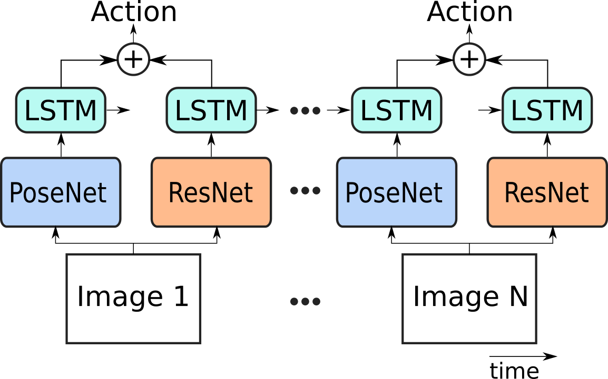
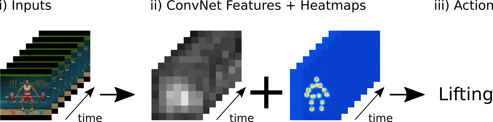

# Human Activity Recognition using Torch7

[](LICENSE.md)

Recognize human activities of individuals using human body joints on video sequences.

This method combines features from a ResNet 50 with human body joint prediction to improve performance in human action recognition applications. It uses a modifed [Stacked Hourglass Network](https://arxiv.org/abs/1603.06937) trained on the LSP+MPII datasets to predict human body joints for a sequence of images.

 <!-- .element height="50%" width="50%" -->


The proposed network takes as input a sequence of images with centered persons which are then processed by two parallel networks that produce image features and 2D heatmaps of human body joint which are then fed to a couple of LSTM layers to compute the classification score for a video sequence.




> Note: This was only tested on the UCF Sports dataset because it had bounding box annotations of humans available.


## Installation

### Requirements

- NVIDIA GPU with compute capability 3.5+ (2GB+ ram)
- [Torch7](http://torch.ch/docs/getting-started.html)
- [dbcollection](https://github.com/dbcollection/dbcollection-torch7)

### Packages/dependencies installation

To use this example code, some packages are required for it to work.

```bash
luarocks install loadcaffe
luarocks install cudnn
luarocks install display
```

### dbcollection

To install the dbcollection package do the following:

- install the Python module (Python>=2.7 and >=3.5).

    ```
    pip install dbcollection
    ```

- install the Lua/Torch7 dbcollection wrapper:

    1. download the Lua/Torch7 git repo to disk.

    ```
    git clone https://github.com/dbcollection/dbcollection-torch7
    ```

    2. install the package.
    ```
    cd dbcollection-torch7 && luarocks make
    ```

> For more information about the dbcollection package see [here](https://github.com/dbcollection/dbcollection-torch7).


# Getting started

## Download/setup this repo

To start using this repo you'll need to clone this repo into your home directory:

```
git clone https://github.com/farrajota/human_activity_torch
```

By default, this repo path points to `~/human_activity_torch/` when running the scripts. If you want to use this repo with another path/directory, you'll need to edit the `projectdir.lua` file in the repo's root dir and set the proper path to where it was cloned.

Next, the necessary data for this code to run is needed to be set. Download the pre-trained models by ruining the script `download_data.lua` script in the `download/` dir:

```
th download/download_data.lua
```

The pre-trained models uses the `cudnn` library, so make sure this package is installed on your system before proceeding any further.


## Train

To train a network, simply run the `train.lua` script to start optimizing the proposed network (ResNet50 + Pose Hms + LSTM) on some default options. The default configurations are detailed in the the paper [TODO- insert paper link]().

To train a network, there are several input arguments to configure the training process. The most important ones are the following (the rest you can leave as defaults):

- `-expID <exp_name>`: experiment id to store all the metadata, logs and model snapshots to disk under the `exp/` dir in the repo's main folder;
- `-dataset <dataset_name>`: indicates which dataset to train on (default=`ucf_sports`); **(warning: for now, the ucf_sports is the only available dataset to train/test on)**
- `-data_dir <path/to/dataset/files>`: Path to store the dataset\'s data files in case you haven't configured the `ucf_sports` previously in `dbcollection`. Specify a path if you want to store the data files into a specific folder.
- `-expDir <path/to/folder>`: specifies which folder to store the experiment directory. By default, it uses the `exp/` dir in the repo's main directory. (optional)
- `-netType <net_type_name>`: specifies which network to train. Options: vgg16-lstm | hms-lstm | vgg16-hms-lstm | vgg16-convnet | hms-convnet | vgg16-hms-convnet.
- `-trainIters <num_iters>`: Number of train iterations per epoch (default=300).
- `-testIters <num_iters>`: Number of test iterations per epoch (default=100).
- `-nEpochs <num_epochs>`: Total number of epochs to runh (default=15).
- `-batchSize <size>`: Mini-batch size (default=4).
- `-seq_length <size>`: Sequence length (number of frames per window) (default=10).

For more information about the available options, see the `options.lua` file or type `th train.lua -help`

> Note: In the `scripts/` dir there are several scripts to train + test other networks with different architectures and configurations. Check them out to see more training configurations specs.

## Test

Evaluating a network is done by running the `test.lua` script with some input arguments. To do so, you need to provide the following input arguments:

- `-expID <exp_name>`: experiment id that contains the model's snapshots + logs;
- `-loadModel <path/to/network.t7>`: if this flag is used, it bypasses the `-expID` flag and loads a specific file;
- `-dataset <dataset_name>`: indicates which dataset to test on (default=`ucf_sports`);
- `-test_progressbar false`: displays text information per iteration instead of a progress bar (optional);
- `-test_load_best false`: if true, it loads the best accuracy model (if exists, optional).

The results of the test, when finished, are displayed on screen and stored in the folder of the network file with the name `Evaluation_full.log`.


## Results

| Method | Accuracy (%) |
| --- | --- |
| Rodriges et al. [1] | 69.2 |
| Lan et al. [2] | 83.7 |
| Jones et al. [3] | **93.5** |
|  |  |
| PoseNet + LSTM | 59.6 |
| ResNet + LSTM | 80.9 |
| **Resnet + PoseNet + LSTM** | **87.2** |


[1] - Rodriguez, M.D., Ahmed, J., Shah, M.: Action mach a spatio-temporal maximum av-
erage correlation height filter for action recognition. In: CVPR, pp. 1–8. IEEE (2008)

[2] - Lan, T., Wang, Y., Mori, G.: Discriminative figure-centric models for joint action local-
ization and recognition. In: ICCV, pp. 2003–2010. IEEE (2011)

[3] - Jones, S., Shao, L., Zhang, J., Liu, Y.: Relevance feedback for real-world human action
retrieval. Pattern Recognition Letters 33(4), 446–452 (2012)

## License

MIT license (see the [LICENSE](LICENSE.md) file)